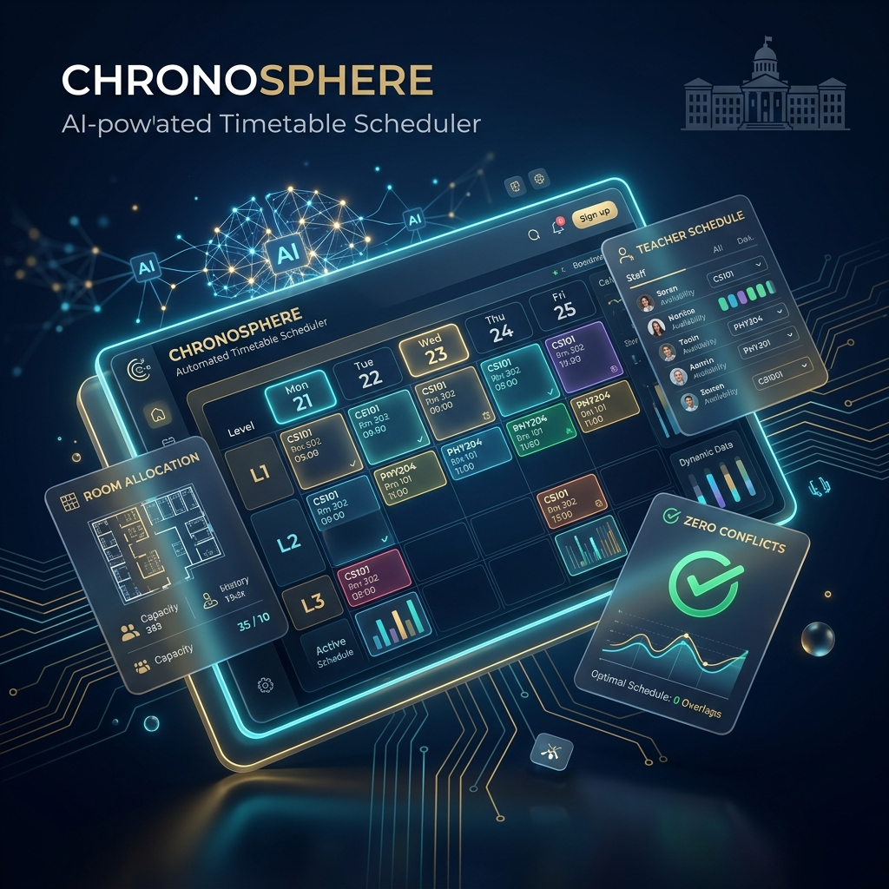

# 🎓 Automated Timetable Scheduler



## ✨ Elevating Academic Scheduling to New Heights

**Automated Timetable Scheduler** is a state-of-the-art, AI-driven orchestration system designed to revolutionize how educational institutions manage their core operations. Crafted for universities and departments that demand precision, this platform transforms the complex, error-prone task of scheduling into a seamless, high-performance experience.

By leveraging advanced constraint satisfaction algorithms, the system ensures perfectly optimized, conflict-free schedules that respect teacher availability, room capacities, and intricate institutional rules—all while providing a premium, intuitive interface for administrators.

---


## 🚀 Features

### ✅ **Automatic Timetable Generation**
- Generates complete semester timetables
- Ensures **zero clashes** for:
  - Teachers
  - Rooms
  - Course sections
  - Lab sessions and theory classes

### ✅ **Constraint Handling**
- Room capacity limits  
- Teacher availability & load  
- Fixed rooms (e.g., labs)  
- Multi-section scheduling  
- Dedicated floors/rooms for departments  
- Non-overlapping slots for shared teachers  
- Custom institutional rules

### ✅ **Admin Dashboard**
- Manage Departments  
- Manage Teachers  
- Manage Sections  
- Manage Courses  
- Manage Rooms  
- Generate & download timetable  

### ✅ **Smart Scheduling Algorithm**
Implements a custom scheduling logic using:
- Constraint Satisfaction  
- Optimization rules  
- Intelligent clash prevention  

---

## 🏗️ Tech Stack

### **Backend**
- Python / Django / Django REST Framework
- Custom scheduling algorithm

### **Frontend**
- React.js / Next.js (if applicable)
- TailwindCSS + UI components

### **Database**
- PostgreSQL / MySQL / SQLite (depending on configuration)

### **Tools**
- Git & GitHub  
- Docker (optional)  
- Postman API testing  

---

## 📂 Project Structure


---

## ⚙️ Installation & Setup

### ✅ Clone the repository
```bash
git clone https://github.com/QamerHassan/Automated-TimeTable-Schedular.git
cd Automated-TimeTable-Schedular
